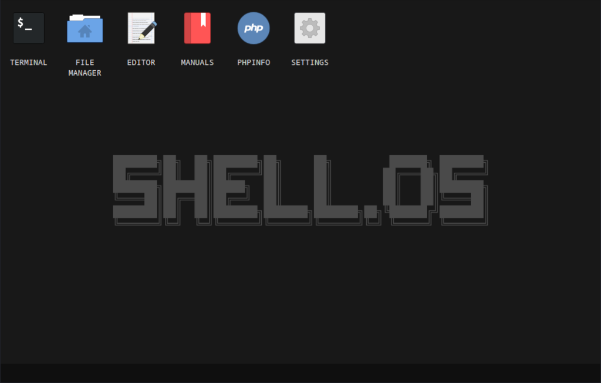

# Shell.OS - An "OS-like system" PHP shell


Shell.OS is a PHP web shell, but with an OS-like interface. It can be useful for CTF's and Red Teams Pentest Labs.

## ⚠️ DISCLAIMER ⚠️

This software is provided for educational purposes and is intended to be used in a controlled environment such as Capture The Flag (CTF) challenges and penetration testing labs. The author is not responsible for any unlawful or illegal use of this software. By using this software, you agree to take full responsibility for your actions.

> Just a quick note, this is more of a fun/hobby project than a polished tool. Use it as is, but don't count on it for critical tasks.

## Screenshot



## Features

- \*NIX like terminal (multiple instances)
- File manager with grid/list view
- Context menu for file/folder manipulation
- Ability to download/upload files
- Text editor (multiple instances)
- Ability to open/edit/save files
- Ability to load/save editor files locally
- Useful Red Team manuals in Markdown format
- phpInfo() viewer
- Settings (themes, preferences...)

## Getting Started

The webshell has a complete website structure, so it is not a single php file. To make life easier, there is a helper called `manager.php`.

### 🏗️ Building the project

The `build.py` script does the following:

1. Pack the contents of src_shell into a .tar.xz file with maximum compression.
2. Encodes the .tar.xz package to base64
3. Write the base64 string to manager.php
4. Output the built manager.php to the /build folder

To build, just run

```bash
./build.py
```

> NOTE: Pass the -r or --random flag to get a random filename for the manager.

## 💻️ Usage

After uploading the manager.php to the server, we can use the following commands:

- `/help` - Display this help message
- `/upload` - Upload the shell to the server
- `/status` - Checks if the shell has been uploaded
- `/delete` - Delete the shell from the server
- `/nuke` - Nuke all uploaded files on the server
- Or type a Linux command to run it.

We can use the `/upload` command to upload the shell.tar.xz and automatically extract it.
Then the manager will tell us where the shell is, and we can access it.

### 🐋 Running locally with Docker

If you want to try it locally in a safe environment:

```bash
docker build -t shell-os .
docker run -it -p 8080:80 -d shell-os:latest
```

Then use your browser to go to http://127.0.0.1:8080/manager.php

### 🐘 Test with PHP native built-in web server

If you want to have a quick look, run the source code on-the-fly,
or develop a new feature, you can use php's built-in web server feature.

For the shell, go to the src_shell folder, then run

```bash
php -S localhost:8080
```

Then with the browser go to: http://localhost:8080

> And for the manager it is the same, but the browser should point to:
> http://localhost:8080/manager.php

## License

This project is licensed under the [MIT License](./LICENSE).

## 🪲 Issues

If you have any questions, features implementations,
or issues, please [open an issue](https://github.com/00xBAD/shell-os/issues)
on my GitHub repository.

## ☕️ Support

If you would like to support my projects,
please consider making a small donation on my ko-fi page.

[](https://ko-fi.com/N4N4RWQX7)
